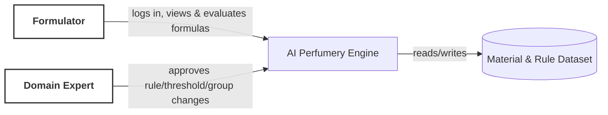
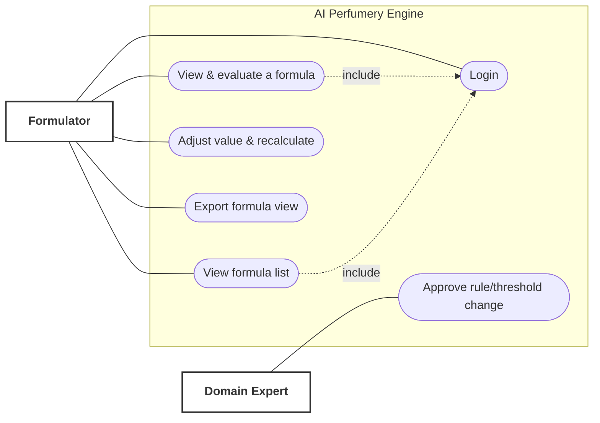
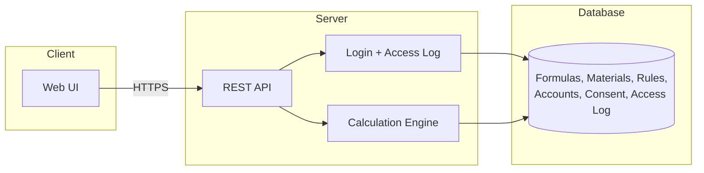
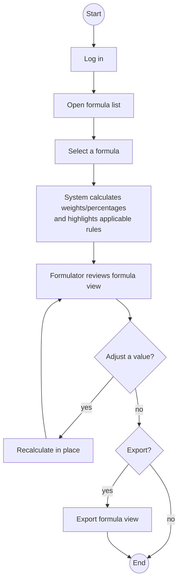

# Diagrams (D1–D4)

All four diagrams describe the same system and the same one core workflow as
`feature-list.md`/`user-journey.md`: actors **Formulator** and **Domain Expert**, system
**AI Perfumery Engine**. Rendered as Mermaid (GitHub and most Markdown viewers render these
natively); source diagram tool alternatives (draw.io/Figma/PlantUML) can replace these later
without changing what they show.

## D1 — System Context

What it shows: the system as one box, plus the actors and data store outside it. No internal
detail — just the boundary.

## D2 — Use Case

What it shows: which actor can do what. The core use case ("View & evaluate a formula") is
central and includes Login, matching the journey's step order.

## D3 — High-Level Architecture

What it shows: layers and data direction, kept deliberately generic (no framework named) since
no technology stack has been decided yet (`project-context.md` §29) — this diagram must not be
read as a stack decision.

## D4 — Activity

What it shows: one scenario, start to end — the same steps as `user-journey.md`, including the
two optional branches (what-if edit loops back to review; export is optional before end).

